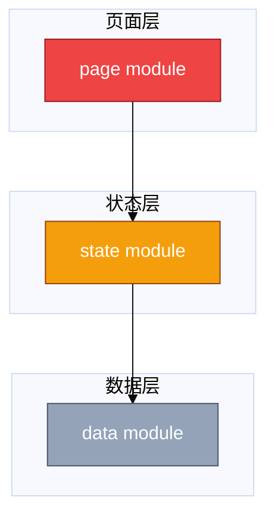

# Module Relationship Mermaid

Use this bundled skill after `frontend-quickstart` has already identified the main modules worth reading first.

Output should be a Mermaid `flowchart` block that can be placed directly into `project-analysis.md`.

## Purpose

Show which modules should be read first, how they connect, and which path should be read first.

This is not a full architecture diagram.

## Structure

Default to the top-ranked module identified by the internal analysis results.

Group the diagram by these layers when they exist:

- page layer
- state layer
- data layer

Use short labels in the nodes. Put the full file paths or code paths in the text below the diagram.

Only keep the connections that help explain why this part of the code matters.

Prefer one clear main chain from page -> state -> data. If there are supporting modules, hang them off that main chain instead of trying to make every node equally central.

## Color legend

Use these fixed classes:

- red: read this first
- orange: read this next
- slate-blue: related modules

## Mermaid style

Use Mermaid `flowchart`.

Prefer `TB` unless the graph is clearly easier to read in `LR`.

Group nodes with `subgraph` when that helps readability.

Always add a Mermaid `init` block so the diagram has cleaner spacing, larger text, and smoother curves in Markdown renderers that support Mermaid styling.

Use `classDef` blocks for:

- `hot`
- `warm`
- `normal`

Use these colors:

- `hot`: `fill:#ef4444,stroke:#991b1b,color:#ffffff`
- `warm`: `fill:#f59e0b,stroke:#92400e,color:#ffffff`
- `normal`: `fill:#94a3b8,stroke:#475569,color:#ffffff`

Minimal example:

## Rules

- default to the top-ranked module from the internal analysis results
- do not dump raw internal fields into the diagram
- do not use full long paths as node labels
- add short arrow labels when they make the relationship easier to understand
- only add an arrow label when the surrounding Markdown has already stated that exact relationship in code terms; otherwise leave the edge unlabeled
- do not over-connect the graph
- keep the diagram readable in Markdown
- keep the three layer groups visually stable; avoid putting several unrelated page nodes side by side if the real focus is one page
- if one diagram becomes too crowded, split it into two or more Mermaid diagrams instead of forcing everything into one
- prefer fewer, larger nodes over many tiny nodes with long labels

## Companion text

After the Mermaid block, add short Markdown notes:

- 红色：先看这里
- 橙色：接着看这里
- 灰蓝色：相关模块

Then explain each key module in plain language:

- why it is worth reading first
- which responsibilities are mixed together
- which code path should be read next
